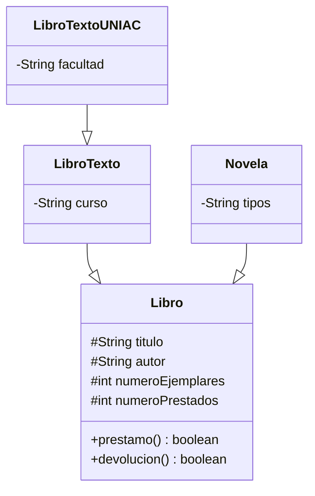

# Diagrama de Clases

```mermaid
classDiagram
    class Libro {
        #String titulo
        #String autor
        #int numeroEjemplares
        #int numeroPrestados
        +prestamo() boolean
        +devolucion() boolean
    }

    class LibroTexto {
        -String curso
    }

    class Novela {
        -String tipos
    }

    class LibroTextoUNIAC {
        -String facultad
    }

    LibroTexto --|> Libro
    LibroTextoUNIAC --|> LibroTexto
    Novela --|> Libro
```