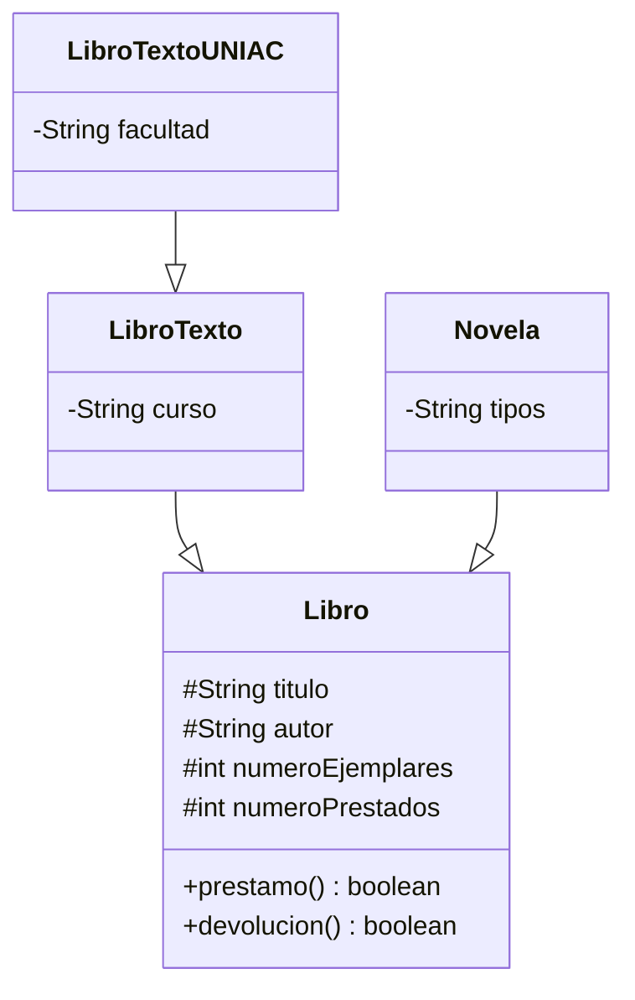

# Diagrama de Clases

## Situaciones donde no se podría aplicar herencia

1. Si la clase Libro se declara como final, las demás clases no podrían heredar de ella.

public final class Libro {

}

2. si se agrega una clase construtor private en libro ninguna clase podria crear objetos de esta clase.

public class Libro {

    private Libro() {
        System.out.println("Constructor privado");
    }

}